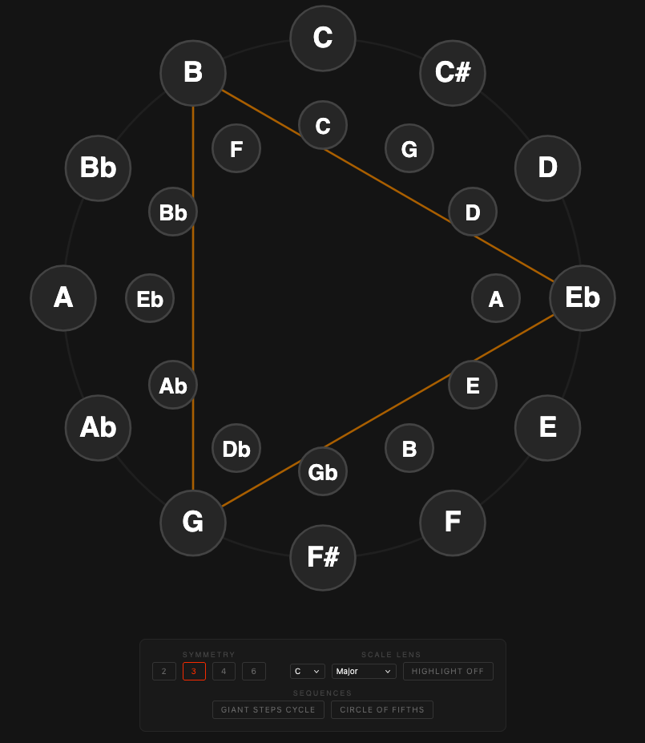

# Coltrane Geometry

An interactive, educational web application built with **Rust (WebAssembly)** and **TypeScript** to visualize the profound mathematical symmetries found in John Coltrane's "Tone Circle."

[**🚀 Play with the Live App Here**](https://mackrus.github.io/coltrane-circle/)



## The Theory

In 1961, John Coltrane sketched a complex geometric diagram that mapped the 12 semitones of the chromatic scale. It revealed that he viewed music not just as sound, but as a fundamental geometric and mathematical law.

This app is a "Theory Calculator" designed to make that math visible and intuitive:

1. **The Rings (Melody vs. Harmony):** 
   - The outer ring represents distance by sound (Chromatic semitones). 
   - The inner ring represents distance by harmony (Circle of Fifths). 
   - Hovering over a note reveals a "Harmonic Bridge" showing how notes exist in both worlds simultaneously.
2. **The Symmetries (The Groups):** 
   - Music is created by dividing the number 12. Triangles divide it by 4 (Major Thirds). Squares divide it by 3 (Minor Thirds). These shapes act as "wormholes" to instantly travel between distant keys, famously used in *Giant Steps*.
3. **The Scale Lens:** 
   - Traditional music lives within a 7-note scale. By applying the scale lens, you can physically see how the abstract geometry steps *outside* the traditional rules.

## Tech Stack

This project uses a modern, high-performance architecture:

* **Engine:** `Rust` compiled to WebAssembly. All musical geometry, intervals, scales, and sequence timing are calculated here.
* **Frontend:** Vanilla `TypeScript` bundled with `Vite`.
* **Audio:** `Tone.js` for precise synthesis and scheduling.
* **Rendering:** Direct DOM manipulation of SVG elements for a crisp, lightweight visualization.

## Local Development

If you want to run or modify this project locally, you will need **Node.js**, **Rust**, and `wasm-pack` installed.

### 1. Install Dependencies
Ensure you have the WebAssembly target for Rust:
```bash
rustup target add wasm32-unknown-unknown
cargo install wasm-pack
```

### 2. Build the Rust Engine
Compile the Rust crate into a WebAssembly module:
```bash
cd theory-crate
wasm-pack build --target web
```
*(Note: A build script in the frontend directory automatically handles copying the generated WASM files to the correct location).*

### 3. Run the Frontend
Copy the WASM files and start the Vite dev server:
```bash
cd www
mkdir -p src/pkg
cp ../theory-crate/pkg/theory_crate_bg.wasm src/pkg/
cp ../theory-crate/pkg/theory_crate.js src/pkg/
npm install
npm run dev
```

The app will be running at `http://localhost:5173`.

## Further Exploration

To dive deeper into the mathematics of John Coltrane's system:
* [Watch: "John Coltrane's Drawing" by Corey Mwamba](https://www.youtube.com/watch?v=rz0dQN9eX_4)
* [Watch: "Giant Steps" animated sheet music](https://www.youtube.com/watch?v=2kotK9FNEYU)
* [Read: "The Geometry of Musical Rhythm" by Godfried Toussaint](http://cgm.cs.mcgill.ca/~godfried/publications/geometry-of-rhythm.pdf)
* [Read: "The Geometry of Musical Chords" by Dmitri Tymoczko (Science)](https://dmitri.mycpanel.princeton.edu/files/publications/science.pdf)
